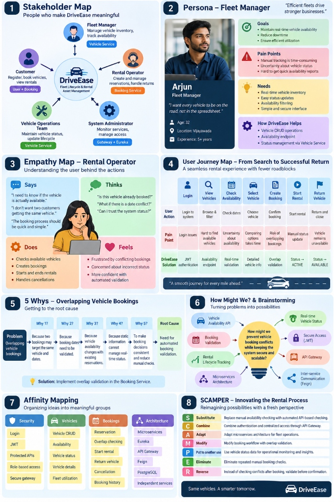
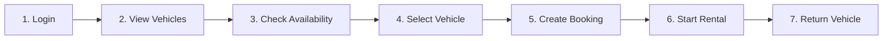

# DriveEase: Fleet Lifecycle & Rental Asset Management Platform
## Design Thinking Framework, System Architecture & Microservices Specification



> **"Efficient fleets drive stronger businesses. Same vehicles. A smarter tomorrow."**

---

## Executive Summary & System Overview

**DriveEase** is an enterprise-grade Fleet Lifecycle & Rental Asset Management microservices platform built with **Spring Boot**, **Spring Cloud**, **Netflix Eureka**, **Spring Cloud API Gateway**, **OpenFeign**, **JWT Authentication**, and **PostgreSQL**.

Modern vehicle rental and fleet management operations struggle with operational bottlenecks: spreadsheet-based vehicle tracking, uncertainty about vehicle availability, manual conflict resolution, and overlapping reservations. DriveEase transforms these operational challenges into a resilient, scalable, event-consistent microservice ecosystem.

---

## Part 1: Design Thinking Framework (Deep-Dive Analysis)

The system was conceived and engineered through an 8-stage Human-Centered Design Thinking methodology:

```
┌─────────────────┐     ┌──────────────────┐     ┌────────────────────┐     ┌──────────────────────┐
│ 1. Stakeholders │ ──> │ 2. User Personas │ ──> │ 3. Empathy Mapping │ ──> │ 4. User Journey Map  │
└─────────────────┘     └──────────────────┘     └────────────────────┘     └──────────────────────┘
         │
         ▼
┌─────────────────┐     ┌──────────────────┐     ┌────────────────────┐     ┌──────────────────────┐
│ 5. Five Whys    │ ──> │ 6. How Might We  │ ──> │ 7. Affinity Map    │ ──> │ 8. SCAMPER Model     │
└─────────────────┘     └──────────────────┘     └────────────────────┘     └──────────────────────┘
```

---

### Panel 1: Stakeholder Map — People Who Make DriveEase Meaningful

The stakeholder ecosystem identifies every role that interacts with or relies upon the DriveEase platform, paired with their respective microservices:

| Stakeholder | Role & Core Responsibilities | Microservice Mapping |
| :--- | :--- | :--- |
| **Customer** | Registers account, discovers vehicles, books rentals, tracks active trips | `user-service` (`:8081`) & `booking-service` (`:8083`) |
| **Fleet Manager** | Manages vehicle inventory, tracks fleet health, adjusts rental pricing, tracks availability | `vehicle-service` (`:8082`) |
| **Rental Operator** | Creates desk reservations, verifies customer identity, dispatches keys, processes returns | `booking-service` (`:8083`) |
| **Vehicle Operations Team** | Conducts inspections, services vehicles, transitions availability status (`MAINTENANCE` / `AVAILABLE`) | `vehicle-service` (`:8082`) |
| **System Administrator** | Monitors gateway throughput, inspects Eureka service registry, manages RBAC permissions | `api-gateway` (`:8080`) & `eureka-server` (`:8761`) |

---

### Panel 2: Persona — Fleet Manager (Arjun)

> *"I want every vehicle to be on the road, not in the spreadsheet."*

* **Name**: Arjun
* **Role**: Fleet Manager
* **Age**: 32 | **Location**: Vijayawada | **Experience**: 5+ years in fleet logistics
* **Goals**:
  1. Maintain real-time vehicle availability across all branch lots.
  2. Minimize vehicle turnaround downtime between customer bookings.
  3. Ensure high fleet utilization rates without risking double bookings.
* **Pain Points**:
  * Manual fleet tracking in Excel sheets is error-prone, asynchronous, and time-consuming.
  * Inability to know whether a car is in transit, undergoing cleaning, or ready for pickup.
  * Generating daily utilization and availability reports takes hours of reconciliation.
* **Core Needs**:
  * Centralized, real-time vehicle inventory with live availability status.
  * Instant status toggle (`AVAILABLE`, `RENTED`, `MAINTENANCE`).
  * Fast filtering endpoints to isolate idle assets ready for revenue generation.
* **How DriveEase Solves It**:
  * Complete RESTful Vehicle CRUD via `vehicle-service`.
  * Dedicated high-performance `/api/vehicles/available` query endpoint.
  * Automated state transitions synchronized with booking lifecycles.

---

### Panel 3: Empathy Map — Rental Operator

Understanding the day-to-day front desk reality of the Rental Operator:

| Dimension | Real-World Observations |
| :--- | :--- |
| **Says** | • *"I need to know if the vehicle is actually available before promising it."*<br>• *"I don't want two customers showing up for the exact same vehicle."*<br>• *"The rental checkout and return process must take less than 60 seconds."* |
| **Thinks** | • *"Is this car truly parked outside or did another desk agent book it?"*<br>• *"What if the dates conflict with a future scheduled reservation?"*<br>• *"Can I trust the software status or do I have to walk outside to verify?"* |
| **Does** | • Checks available fleet via search filters.<br>• Generates and confirms bookings for walk-ins and web customers.<br>• Dispatches keys and activates rentals (`startRental`).<br>• Inspects vehicle odometers upon return and closes tickets (`returnVehicle`). |
| **Feels** | • **Frustrated** by overlapping double-bookings and angry customers.<br>• **Anxious** about conflicting database states and manual mistakes.<br>• **Confident & Relieved** when the system automatically validates date collisions and guards reservations. |

---

### Panel 4: User Journey Map — From Search to Successful Return

*Tagline: "A seamless rental experience with fewer roadblocks"*



| Phase | User Action | Historical Pain Point | DriveEase Architectural Solution |
| :--- | :--- | :--- | :--- |
| **1. Login** | Authenticate into system | Credential theft, session disconnects | **JWT Authentication** filter at API Gateway (`api-gateway`) |
| **2. View Vehicles** | Browse full inventory | Slow catalog queries, stale lists | High-performance indexed query endpoints (`GET /api/vehicles`) |
| **3. Check Availability** | Filter by dates & availability | Uncertainty over actual vehicle state | Dedicated `/api/vehicles/available` status filter |
| **4. Select Vehicle** | Compare types, prices, and models | Fragmented vehicle specifications | Rich vehicle schema (Type, Model, Price, Status) |
| **5. Create Booking** | Confirm reservation dates | **High Risk:** Overlapping double bookings | **Strict Overlap Validation** in `booking-service` & Feign verification |
| **6. Start Rental** | Hand over keys, initiate trip | Manual status tracking, delayed updates | Atomic `/start` endpoint transitions booking `ACTIVE` & vehicle `RENTED` |
| **7. Return Vehicle** | Accept return, inspect vehicle | Vehicle forgotten in `RENTED` state | Atomic `/return` endpoint sets booking `COMPLETED` & vehicle `AVAILABLE` |

---

### Panel 5: 5 Whys — Root Cause Analysis of Overlapping Bookings

* **The Problem**: Customers occasionally experience overlapping bookings for the same vehicle on the same calendar dates.
1. **Why 1?** Two independent bookings target the same vehicle for conflicting date ranges.
2. **Why 2?** The booking creation process did not validate the requested date window against existing reservations.
3. **Why 3?** Vehicle availability changes dynamically as bookings are confirmed, modified, or cancelled.
4. **Why 4?** Static vehicle attributes (e.g. `AVAILABLE` flag) cannot represent temporal reservations across future calendars.
5. **Why 5?** Reservations were treated as isolated database writes without automated cross-date validation.
* **Root Cause**: Need for **automated, date-aware overlap validation** executed synchronously prior to booking persistence.
* **Solution**: Implement `findOverlappingBookings` query and check in `booking-service` before confirming any reservation.

$$\text{Overlap Condition: } (\text{startDate} < \text{existingEndDate}) \land (\text{endDate} > \text{existingStartDate})$$

---

### Panel 6: "How Might We?" (HMW) Brainstorming

> **"How might we prevent vehicle booking conflicts while keeping the system secure, decoupled, and scalable?"**

The solution architecture radiates from this core design question:

```text
                           ┌───────────────────────────┐
                           │   Vehicle Availability    │
                           │            API            │
                           └─────────────┬─────────────┘
                                         │
 ┌──────────────────────┐                │                ┌──────────────────────┐
 │  Secure Access (JWT) │ ───────────────┼─────────────── │  Booking Validation  │
 └──────────────────────┘                │                └──────────────────────┘
                                         ▼
 ┌──────────────────────┐     ┌─────────────────────┐     ┌──────────────────────┐
 │     API Gateway      │ ──> │   HMW: Prevent      │ <── │   Rental Lifecycle   │
 │   Reverse Proxy      │     │  Booking Conflicts  │     │       Tracking       │
 └──────────────────────┘     └─────────────────────┘     └──────────────────────┘
                                         ▲
 ┌──────────────────────┐                │                ┌──────────────────────┐
 │ Microservices & DB   │ ───────────────┼─────────────── │  OpenFeign Service-  │
 │  per Service         │                │                │  to-Service Comms    │
 └──────────────────────┘                │                └──────────────────────┘
                           ┌─────────────┴─────────────┐
                           │  Real-time Status Sync    │
                           │ (AVAILABLE/RENTED/MAINT)  │
                           └───────────────────────────┘
```

---

### Panel 7: Affinity Mapping — Conceptual Grouping

| Pillar | Components & Capabilities |
| :--- | :--- |
| **Security** | User Registration, BCrypt Hashing, JWT Token Generation, Stateless Bearer Validation, API Gateway Pre-routing Filter, Role-Based Access (`CUSTOMER`, `ADMIN`). |
| **Vehicles** | Vehicle CRUD, Availability Filter (`/available`), Status Management (`AVAILABLE`, `RENTED`, `MAINTENANCE`), Pricing Calculator, Fleet Utilization. |
| **Bookings** | Reservation Lifecycle, Date Overlap Verification, Start Rental Transition, Return Vehicle Transition, Cancellation Handling, History by User/Vehicle. |
| **Architecture** | Independent Microservices, Netflix Eureka Registry, Spring Cloud Gateway, OpenFeign Synchronous RPC, Decoupled PostgreSQL Databases. |

---

### Panel 8: SCAMPER Framework — Innovating the Rental Experience

| Principle | Meaning in DriveEase | Concrete Implementation |
| :---: | :--- | :--- |
| **S** | **Substitute** | Replace manual availability checking with automated API-based query endpoints. |
| **C** | **Combine** | Combine centralized authentication, rate limiting, and reverse proxy routing inside the API Gateway (`:8080`). |
| **A** | **Adapt** | Adapt modern Cloud-Native microservice architectural patterns for physical fleet operations. |
| **M** | **Modify** | Modify booking persistence workflow to mandate mathematical date-overlap validation prior to commit. |
| **P** | **Put to another use** | Leverage vehicle status records for operational maintenance scheduling and utilization analytics. |
| **E** | **Eliminate** | Eliminate redundant manual desk confirmations and double-booking risks entirely. |
| **R** | **Reverse** | Instead of discovering conflicts post-reservation, validate temporal conflicts **before** confirming the booking. |

---

## Part 2: Technical Architecture & Topology

```text
                                     CLIENTS
                       (Postman / Web Browser / Mobile)
                                        │
                                        │ Requests to http://localhost:8080
                                        ▼
                      ┌───────────────────────────────────┐
                      │    SPRING CLOUD API GATEWAY       │
                      │           Port: 8080              │
                      │  • Global JWT Authentication      │
                      │  • Path Routing & Load Balancing  │
                      └─────────────────┬─────────────────┘
                                        │
             ┌──────────────────────────┼──────────────────────────┐
             │                          │                          │
             ▼                          ▼                          ▼
   ┌───────────────────┐      ┌───────────────────┐      ┌───────────────────┐
   │   USER-SERVICE    │      │  VEHICLE-SERVICE  │      │  BOOKING-SERVICE  │
   │    Port: 8081     │      │    Port: 8082     │      │    Port: 8083     │
   │  • Auth & Profile │      │  • Fleet Assets   │      │  • Reservations   │
   │  • BCrypt & JWT   │      │  • Status Mgmt    │      │  • Feign Client   │
   └─────────┬─────────┘      └─────────┬─────────┘      └─────────┬─────────┘
             │                          │                          │
             ▼                          ▼                          ▼
       PostgreSQL DB              PostgreSQL DB              PostgreSQL DB
    driveease_user_db          driveease_vehicle_db       driveease_booking_db
             │                          │                          │
             └──────────────────────────┼──────────────────────────┘
                                        │
                                        ▼
                            ┌───────────────────────┐
                            │     EUREKA SERVER     │
                            │      Port: 8761       │
                            │   Service Registry    │
                            └───────────────────────┘
```

---

## Part 3: Live Postman & cURL Testing Guide

### Architecture Rules for Live Testing
1. **API Gateway Base URL**: `http://localhost:8080` (Standard route for all requests).
2. **Direct Service Ports** (Bypassing Gateway for debugging):
   * Eureka Server: `http://localhost:8761`
   * User Service: `http://localhost:8081`
   * Vehicle Service: `http://localhost:8082`
   * Booking Service: `http://localhost:8083`
3. **Authentication**: All protected endpoints require header:
   `Authorization: Bearer <your_jwt_token>`

---

### Step 1: User Service — Authentication & Profile

#### 1.1 Register a New User (Public)
* **Method**: `POST`
* **URL**: `http://localhost:8080/api/users`
* **Headers**: `Content-Type: application/json`
* **Request Body**:
```json
{
  "name": "Arjun Fleet",
  "email": "arjun.fleet@driveease.com",
  "password": "Password@123",
  "role": "CUSTOMER",
  "phone": "+91-9876543210"
}
```
* **Expected Response** (`201 Created`):
```json
{
  "userId": 1,
  "name": "Arjun Fleet",
  "email": "arjun.fleet@driveease.com",
  "role": "CUSTOMER",
  "phone": "+91-9876543210"
}
```

#### 1.2 User Login (Public — Capture Token)
* **Method**: `POST`
* **URL**: `http://localhost:8080/api/users/login`
* **Headers**: `Content-Type: application/json`
* **Request Body**:
```json
{
  "email": "arjun.fleet@driveease.com",
  "password": "Password@123"
}
```
* **Expected Response** (`200 OK`):
```json
{
  "token": "eyJhbGciOiJIUzM4NCJ9.eyJzdWIiOiJhcmp1bi5mbGVldEBkcml2ZWVhc2UuY29tIiwidXNlcklkIjoxLCJyb2xlIjoiQ1VTVE9NRVIifQ..."
}
```
> **Action**: Copy the value of `"token"`. You will use it as `Bearer <token>` for all following requests.

#### 1.3 Get All Users (Protected)
* **Method**: `GET`
* **URL**: `http://localhost:8080/api/users`
* **Headers**: `Authorization: Bearer <token>`

#### 1.4 Get User By ID (Protected)
* **Method**: `GET`
* **URL**: `http://localhost:8080/api/users/1`
* **Headers**: `Authorization: Bearer <token>`

#### 1.5 Update User (Protected)
* **Method**: `PUT`
* **URL**: `http://localhost:8080/api/users/1`
* **Headers**:
  * `Authorization: Bearer <token>`
  * `Content-Type: application/json`
* **Request Body**:
```json
{
  "name": "Arjun Senior Fleet",
  "email": "arjun.fleet@driveease.com",
  "role": "CUSTOMER",
  "phone": "+91-9999988888"
}
```

#### 1.6 Delete User (Protected)
* **Method**: `DELETE`
* **URL**: `http://localhost:8080/api/users/1`
* **Headers**: `Authorization: Bearer <token>`

---

### Step 2: Vehicle Service — Fleet Asset Management

#### 2.1 Add Vehicle 1 (Protected)
* **Method**: `POST`
* **URL**: `http://localhost:8080/api/vehicles`
* **Headers**:
  * `Authorization: Bearer <token>`
  * `Content-Type: application/json`
* **Request Body**:
```json
{
  "type": "Sedan",
  "model": "Tesla Model 3",
  "availabilityStatus": "AVAILABLE",
  "rentalPrice": 85.0
}
```
* **Expected Response** (`201 Created`):
```json
{
  "vehicleId": 1,
  "type": "Sedan",
  "model": "Tesla Model 3",
  "availabilityStatus": "AVAILABLE",
  "rentalPrice": 85.0
}
```

#### 2.2 Add Vehicle 2 (Protected)
* **Method**: `POST`
* **URL**: `http://localhost:8080/api/vehicles`
* **Headers**:
  * `Authorization: Bearer <token>`
  * `Content-Type: application/json`
* **Request Body**:
```json
{
  "type": "SUV",
  "model": "Toyota RAV4 Hybrid",
  "availabilityStatus": "AVAILABLE",
  "rentalPrice": 70.0
}
```

#### 2.3 Get All Vehicles (Protected)
* **Method**: `GET`
* **URL**: `http://localhost:8080/api/vehicles`
* **Headers**: `Authorization: Bearer <token>`

#### 2.4 Get Available Vehicles (Protected)
* **Method**: `GET`
* **URL**: `http://localhost:8080/api/vehicles/available`
* **Headers**: `Authorization: Bearer <token>`

#### 2.5 Get Vehicle By ID (Protected)
* **Method**: `GET`
* **URL**: `http://localhost:8080/api/vehicles/1`
* **Headers**: `Authorization: Bearer <token>`

#### 2.6 Update Vehicle Details (Protected)
* **Method**: `PUT`
* **URL**: `http://localhost:8080/api/vehicles/1`
* **Headers**:
  * `Authorization: Bearer <token>`
  * `Content-Type: application/json`
* **Request Body**:
```json
{
  "type": "Sedan",
  "model": "Tesla Model 3 Long Range",
  "availabilityStatus": "AVAILABLE",
  "rentalPrice": 95.0
}
```

#### 2.7 Update Vehicle Status Only (Protected)
* **Method**: `PUT`
* **URL**: `http://localhost:8080/api/vehicles/1/status`
* **Headers**:
  * `Authorization: Bearer <token>`
  * `Content-Type: application/json`
* **Request Body**:
```json
{
  "status": "MAINTENANCE"
}
```

#### 2.8 Delete Vehicle (Protected)
* **Method**: `DELETE`
* **URL**: `http://localhost:8080/api/vehicles/2`
* **Headers**: `Authorization: Bearer <token>`

---

### Step 3: Booking Service — Lifecycle & Conflict-Free Reservations

#### 3.1 Create Booking with Date Validation (Protected)
* **Method**: `POST`
* **URL**: `http://localhost:8080/api/bookings`
* **Headers**:
  * `Authorization: Bearer <token>`
  * `Content-Type: application/json`
* **Request Body**:
```json
{
  "userId": 1,
  "vehicleId": 1,
  "startDate": "2026-10-01",
  "endDate": "2026-10-05"
}
```
* **Expected Response** (`201 Created`):
```json
{
  "bookingId": 1,
  "userId": 1,
  "vehicleId": 1,
  "startDate": "2026-10-01",
  "endDate": "2026-10-05",
  "totalPrice": 380.0,
  "status": "CONFIRMED"
}
```

#### 3.2 Test Overlap Conflict Rejection (Expect 400 Bad Request)
* **Method**: `POST`
* **URL**: `http://localhost:8080/api/bookings`
* **Headers**:
  * `Authorization: Bearer <token>`
  * `Content-Type: application/json`
* **Request Body** (Conflicting dates with Booking 1):
```json
{
  "userId": 1,
  "vehicleId": 1,
  "startDate": "2026-10-03",
  "endDate": "2026-10-07"
}
```
* **Expected Response** (`400 Bad Request`):
```json
{
  "error": "Conflict",
  "message": "Vehicle is already booked for the selected dates."
}
```

#### 3.3 Get All Bookings (Protected)
* **Method**: `GET`
* **URL**: `http://localhost:8080/api/bookings`
* **Headers**: `Authorization: Bearer <token>`

#### 3.4 Get Booking By ID (Protected)
* **Method**: `GET`
* **URL**: `http://localhost:8080/api/bookings/1`
* **Headers**: `Authorization: Bearer <token>`

#### 3.5 Get Bookings By User ID (Protected)
* **Method**: `GET`
* **URL**: `http://localhost:8080/api/bookings/user/1`
* **Headers**: `Authorization: Bearer <token>`

#### 3.6 Get Bookings By Vehicle ID (Protected)
* **Method**: `GET`
* **URL**: `http://localhost:8080/api/bookings/vehicle/1`
* **Headers**: `Authorization: Bearer <token>`

#### 3.7 Start Rental Lifecycle (Protected — Transitions Booking & Vehicle)
* **Method**: `PUT`
* **URL**: `http://localhost:8080/api/bookings/1/start`
* **Headers**: `Authorization: Bearer <token>`
* **Result**:
  * Booking Status changes to `ACTIVE`
  * Vehicle Status automatically transitions to `RENTED` via Feign client!

#### 3.8 Return Vehicle Lifecycle (Protected — Closes Trip & Restores Vehicle)
* **Method**: `PUT`
* **URL**: `http://localhost:8080/api/bookings/1/return`
* **Headers**: `Authorization: Bearer <token>`
* **Result**:
  * Booking Status changes to `COMPLETED`
  * Vehicle Status automatically transitions back to `AVAILABLE`!

#### 3.9 Cancel Booking (Protected)
* **Method**: `PUT`
* **URL**: `http://localhost:8080/api/bookings/1/cancel`
* **Headers**: `Authorization: Bearer <token>`

#### 3.10 Delete Booking (Protected)
* **Method**: `DELETE`
* **URL**: `http://localhost:8080/api/bookings/1`
* **Headers**: `Authorization: Bearer <token>`

---

### Step 4: Eureka Service Registry Inspection

* **Method**: `GET`
* **URL**: `http://localhost:8761/eureka/apps`
* **Headers**: `Accept: application/json`
* **Result**: Returns registration state for all 4 microservices:
  1. `API-GATEWAY`
  2. `USER-SERVICE`
  3. `VEHICLE-SERVICE`
  4. `BOOKING-SERVICE`

---

## Part 4: Summary Table of Microservices Endpoints

| Service | Port | Endpoint | Method | Access | Description |
| :--- | :--- | :--- | :---: | :---: | :--- |
| **User** | `:8081` | `/api/users` | `POST` | Public | Register new customer or admin |
| **User** | `:8081` | `/api/users/login` | `POST` | Public | Authenticate and obtain JWT token |
| **User** | `:8081` | `/api/users` | `GET` | Bearer | Retrieve all registered users |
| **User** | `:8081` | `/api/users/{id}` | `GET` | Bearer | Retrieve single user by ID |
| **User** | `:8081` | `/api/users/{id}` | `PUT` | Bearer | Update user profile information |
| **User** | `:8081` | `/api/users/{id}` | `DELETE` | Bearer | Delete user profile |
| **Vehicle** | `:8082` | `/api/vehicles` | `POST` | Bearer | Add new vehicle to inventory |
| **Vehicle** | `:8082` | `/api/vehicles` | `GET` | Bearer | Retrieve all vehicles |
| **Vehicle** | `:8082` | `/api/vehicles/available`| `GET` | Bearer | Retrieve only available vehicles |
| **Vehicle** | `:8082` | `/api/vehicles/{id}` | `GET` | Bearer | Retrieve vehicle details by ID |
| **Vehicle** | `:8082` | `/api/vehicles/{id}` | `PUT` | Bearer | Update vehicle details and price |
| **Vehicle** | `:8082` | `/api/vehicles/{id}/status`| `PUT` | Bearer | Update status (`AVAILABLE`/`MAINTENANCE`) |
| **Vehicle** | `:8082` | `/api/vehicles/{id}` | `DELETE` | Bearer | Remove vehicle from fleet |
| **Booking** | `:8083` | `/api/bookings` | `POST` | Bearer | Reserve vehicle with overlap check |
| **Booking** | `:8083` | `/api/bookings` | `GET` | Bearer | List all bookings |
| **Booking** | `:8083` | `/api/bookings/{id}` | `GET` | Bearer | Get booking details |
| **Booking** | `:8083` | `/api/bookings/user/{userId}`| `GET`| Bearer| List bookings for a specific customer |
| **Booking** | `:8083` | `/api/bookings/vehicle/{vId}`| `GET`| Bearer| List bookings for a specific vehicle |
| **Booking** | `:8083` | `/api/bookings/{id}/start`| `PUT`| Bearer | Check-out vehicle (`ACTIVE` / `RENTED`) |
| **Booking** | `:8083` | `/api/bookings/{id}/return`| `PUT`| Bearer | Check-in vehicle (`COMPLETED` / `AVAILABLE`) |
| **Booking** | `:8083` | `/api/bookings/{id}/cancel`| `PUT`| Bearer | Cancel reservation |
| **Booking** | `:8083` | `/api/bookings/{id}` | `DELETE` | Bearer | Delete booking record |
| **Eureka** | `:8761` | `/eureka/apps` | `GET` | Public | Live registry status of all services |
